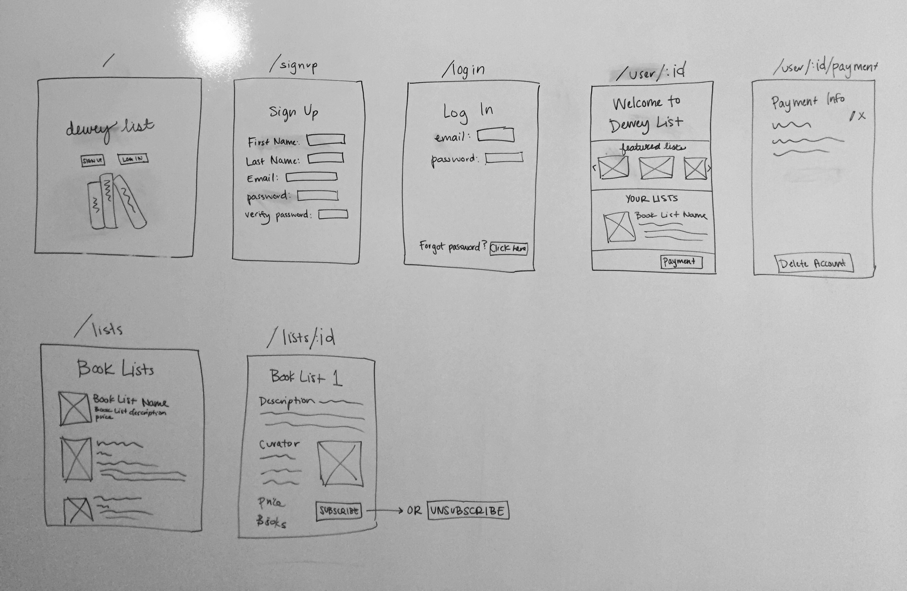
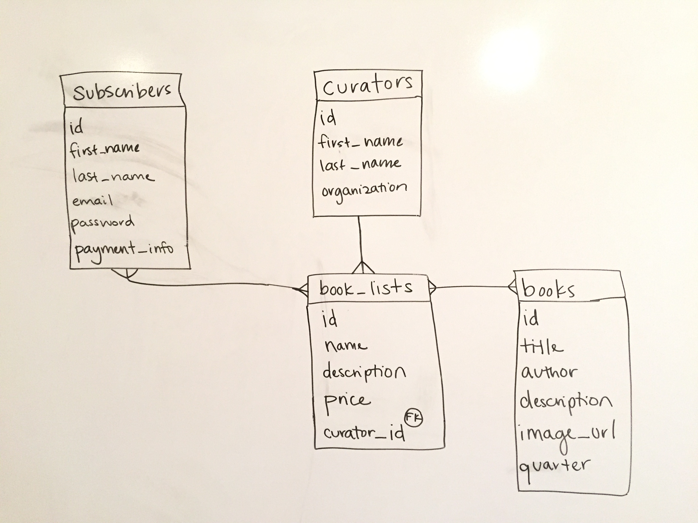

# Dewey List

## Overview

For WDI project #5, I created a web application called Dewey List. Dewey List allows users to subscribe to curated book lists. Book lists are curated by influencers or organizations with a cause. A portion of proceeds from each book sale goes to support a charitable organization of the curator’s choice.

Users can create an account and log in. The user can then view a list of all book lists, as well as list-specific details. The user can subscribe and unsubscribe from lists. If the user is assigned a role of curator, she can create, update, and delete lists.

**Live site:** https://www.deweylist.com/

## Technologies Used

- Languages - Ruby, CSS3, HTML5
- Platforms & Frameworks - Rails
- Database - SQL, Postgresql
- Design - Materialize, Google Fonts, Adobe Illustrator
- Authentication & Authorization - Devise, CanCanCan
- Deployment - Heroku
- Text Editor - Atom

## Wireframe

## ERD

## Project Pitch

[Slides](https://docs.google.com/presentation/d/1rsifvy7MsnoQ6qv97J85pTvydEhE45a5lMrjS04xZ1E/edit?usp=sharing)

## Future Development Goals

- Create book show page
- Add book CRUD functionality for curators
- Ensure list CRUD functionality is assigned only to the curator who created list
- Integrate Stripe
- Optimize images
